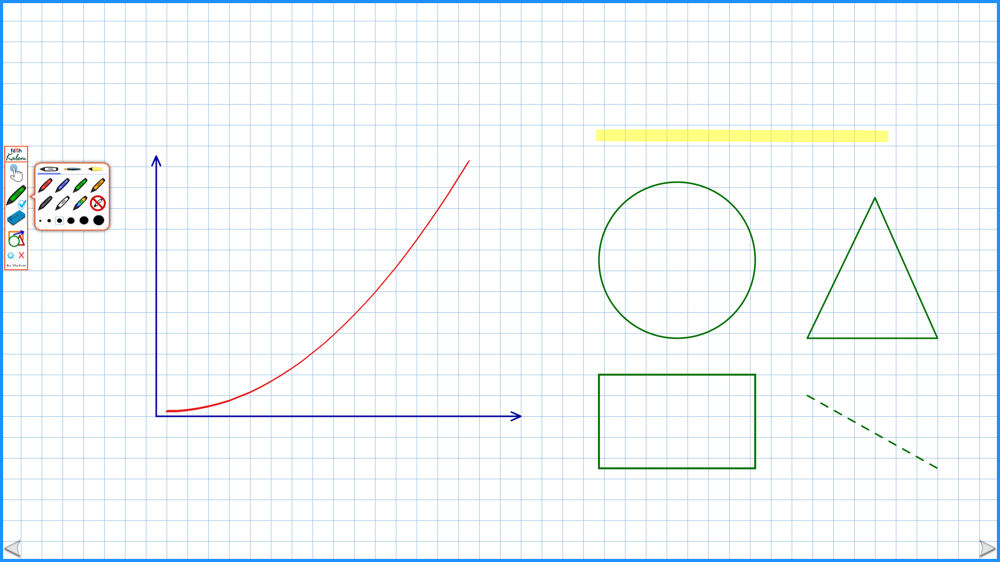
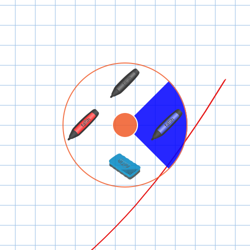
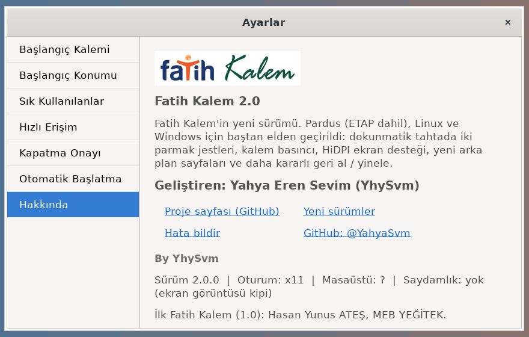

<div align="center">


# Fatih Kalem 2.0

### Etkileşimli tahtalar için ekran kalemi

Ekrandaki her şeyin (e-kitap, sunum, video, tarayıcı) üzerine yazın, çizin, vurgulayın.
**Pardus ETAP** ve **Windows** çalıştıran Fatih Projesi tahtaları için geliştirildi.

[](https://github.com/YahyaSvm/Fatih-Kalem-Source/releases/latest)
[](https://github.com/YahyaSvm/Fatih-Kalem-Source/actions/workflows/release.yml)
[](https://github.com/YahyaSvm/Fatih-Kalem-Source/releases)
[](#platform-desteği)
[](#platform-desteği)

**[⬇ İndir](https://github.com/YahyaSvm/Fatih-Kalem-Source/releases/latest)** &nbsp;·&nbsp;
[Kurulum](#kurulum) &nbsp;·&nbsp;
[Kullanım](#kullanım) &nbsp;·&nbsp;
[Pardus Rehberi](linux/README.md) &nbsp;·&nbsp;
[Hata Bildir](https://github.com/YahyaSvm/Fatih-Kalem-Source/issues/new)

<br>



</div>

<br>

## İçindekiler

- [Neden Fatih Kalem 2.0?](#neden-fatih-kalem-20)
- [Özellikler](#özellikler)
- [Ekran Görüntüleri](#ekran-görüntüleri)
- [Platform Desteği](#platform-desteği)
- [Kurulum](#kurulum)
- [Kullanım](#kullanım)
- [Sık Sorulan Sorular](#sık-sorulan-sorular)
- [Kaynaktan Derleme](#kaynaktan-derleme)
- [Proje Yapısı](#proje-yapısı)
- [Yol Haritası](#yol-haritası)
- [Katkıda Bulunma](#katkıda-bulunma)
- [Haklar ve Teşekkür](#haklar-ve-teşekkür)

---

## Neden Fatih Kalem 2.0?

Okullardaki etkileşimli tahtalar artık büyük ölçüde **Pardus ETAP** ile çalışıyor,
ancak öğretmenlerin alıştığı Fatih Kalem yalnızca Windows'ta vardı. 2.0 sürümü bu
boşluğu kapatır:

- **Aynı arayüz, her iki sistemde.** Menü, simgeler, renkler ve dokunma noktaları
  Windows ve Pardus'ta birebir aynıdır; öğretmenin yeniden öğrenmesi gereken bir şey yoktur.
- **Ek kurulum gerektirmez.** Pardus sürümü, sistemde hazır gelen Python 3 ve GTK3
  ile çalışır; internet bağlantısı olmadan tek paketle kurulur.
- **Tahta için tasarlandı.** İki parmak jestleri, kalem basıncı, silgi ucu,
  büyük dokunma alanları ve 4K ekran desteği.
- **Daha kararlı.** Windows sürümündeki geri al/yinele ve otomatik başlatma
  hataları giderildi; beklenmeyen hatalar kayıt altına alınır.

## Özellikler

<table>
<tr>
<td width="50%" valign="top">

#### ✏️ Yazma ve çizme
- **3 kalem tipi:** keçeli, dolma, fosforlu
- **6 hazır renk** ve **24 renklik kartela**
- **6 kalınlık**, basınca duyarlı kalem desteği
- Fosforlu kalem yazının **altında** kalır, üst üste geçince koyulaşmaz

#### 📐 Şekiller
- Çizgi, kesikli çizgi, ok
- Dikdörtgen, elips, üçgen

#### 🧽 Silgi ve geçmiş
- **4 boyutta silgi**; çizginin yalnızca değdiği kısmını siler
- Kalemin **silgi ucu** otomatik olarak silgi olur
- Çok adımlı **geri al / yinele**

</td>
<td width="50%" valign="top">

#### 🖐️ Tahta deneyimi
- **İki parmak jestleri:** çekilen yöne göre renk ya da silgi
- **Kısa çekiş:** menü parmağınızın yanına gelir
- **El modu:** menü küçülür, masaüstü normal kullanılır
- **Kalemsiz mod:** çizimler kalır, tıklamalar alttaki uygulamaya geçer
- Sürüklenip fırlatılabilen menü, ekran kenarı **çağırma okları**

#### 🎓 Ders araçları
- **Perde:** ekranın yalnızca seçilen kısmını gösterir
- **Görsel kütüphanesi:** taşı, büyüt, döndür
- **Arka plan sayfaları:** beyaz, çizgili, kareli, milimetrik,
  noktalı, yeşil tahta, siyah tahta
- **Sık kullanılanlar:** en çok kullandığınız 20 komut ana menüde

</td>
</tr>
</table>

## Ekran Görüntüleri

<table>
<tr>
<td align="center" width="22%"><br><sub><b>Ana menü</b></sub></td>
<td align="center" width="34%"><br><sub><b>İki parmak jesti</b></sub></td>
<td align="center" width="44%"><br><sub><b>Ayarlar (Pardus)</b></sub></td>
</tr>
</table>

## Platform Desteği

| Sistem | Masaüstü | Durum | Paket |
|---|---|:---:|---|
| **Pardus ETAP 23** | ETAP | ✅ Birincil hedef | `.deb` |
| Pardus 25 / 23 | GNOME (Wayland / X11), XFCE | ✅ Destekleniyor | `.deb` |
| Pardus 21 / ETAP 19–21 | XFCE | 🧪 Deneysel | `.deb` |
| Debian 11+ / Ubuntu 22.04+ | GNOME, XFCE, Cinnamon, MATE | 🧪 Deneysel | `.deb` |
| Windows 10 / 11 | — | ✅ Destekleniyor | `.zip` |
| Windows 7 / 8.1 | — | ⚠️ .NET Framework 4.8 gerekir | `.zip` |

> **Wayland:** GNOME Wayland oturumlarında program otomatik olarak XWayland üzerinden
> açılır; ek ayar gerekmez. <br>
> **Saydamlık kapalı masaüstleri:** Bileşikleştirici (compositor) olmayan eski
> tahtalarda program ekran görüntüsü kipine geçerek çalışmaya devam eder.

## Kurulum

En güncel dosyalar **[Releases](https://github.com/YahyaSvm/Fatih-Kalem-Source/releases/latest)** sayfasındadır.

### Pardus / ETAP

**Grafik arayüzle:** `fatih-kalem_2.0.0_all.deb` dosyasına çift tıklayın ve **Yükle**'ye basın.

**Uçbirimle:**

```bash
sudo apt install ./fatih-kalem_2.0.0_all.deb
```

**İnternet bağlantılı tahtada tek komutla:**

```bash
wget https://github.com/YahyaSvm/Fatih-Kalem-Source/releases/download/v2.0.0/fatih-kalem_2.0.0_all.deb \
  && sudo apt install ./fatih-kalem_2.0.0_all.deb
```

Kurulumdan sonra program **Uygulamalar → Eğitim → Fatih Kalem** altında yer alır.

<details>
<summary><b>Tüm kullanıcılarda açılışta otomatik başlatma (okul BT yöneticileri için)</b></summary>

<br>

```bash
sudo cp /usr/share/applications/fatih-kalem.desktop /etc/xdg/autostart/
```

Tek bir kullanıcı için **Ayarlar → Otomatik Başlatma** bölümü yeterlidir. Eski (Faz-1)
tahtalarda daha hızlı açılış için aynı bölümdeki **ön yükleme** seçeneği önerilir.

</details>

<details>
<summary><b>Kaldırma</b></summary>

<br>

```bash
sudo apt remove fatih-kalem
```

Kullanıcı ayarları `~/.config/fatih-kalem/` klasöründe kalır.

</details>

Wayland, saydamlık, dokunmatik kalibrasyon ve sorun giderme ayrıntıları için
**[Pardus Rehberi](linux/README.md)**'ne bakın.

### Windows

1. `FatihKalem-2.0.0-windows.zip` dosyasını indirip bir klasöre açın.
2. `Fatih Kalem.exe` dosyasını çalıştırın.

.NET Framework 4.8 gerekir (Windows 10 ve 11'de hazır gelir).

## Kullanım

| Menü öğesi | Ne yapar? |
|---|---|
| **Fatih Kalem başlığı** | Basılı tutup sürükleyin; fırlatırsanız kayarak ilerler. |
| **Kalem / El** | Kalem moduna geçer. El moduna dönüldüğünde çizimler temizlenir. |
| **Kalem** | Kalem tipi, renk, kartela, kalemsiz mod ve kalınlık. |
| **Silgi** | Geri al, yinele, perde ve dört silgi boyutu. |
| **Şekiller** | Altı şekil, görsel kütüphanesi ve arka plan sayfaları. |
| **⚙ Ayarlar** | Başlangıç kalemi ve konumu, sık kullanılanlar, hızlı erişim, otomatik başlatma. |
| **✕ Kapat** | Programı kapatır (isteğe bağlı onayla). |

**İki parmak jestleri** — bir parmak tahtadayken ikinci parmağı koyup çekin:

| Yön | Sonuç |
|:---:|---|
| ⬅️ Sol | Kırmızı kalem |
| ➡️ Sağ | Mavi kalem |
| ⬆️ Yukarı | Siyah kalem (fosforluda sarı) |
| ⬇️ Aşağı | Silgi (tekrar çekince kaleme döner) |
| Kısa çekiş | Menü parmağınızın yanına gelir |

Farede aynı jestler **sağ tuşa basılı tutarak** yapılır. Alt menüdeki bir öğeye
**uzun basmak** (farede sağ tık) onu ana menüye sık kullanılan olarak ekler.

## Sık Sorulan Sorular

<details>
<summary><b>Kurulum için internet gerekir mi?</b></summary>
<br>
Hayır. Pardus'ta gereken tüm kitaplıklar hazır gelir; <code>.deb</code> dosyasını USB bellekle taşımanız yeterlidir.
</details>

<details>
<summary><b>Yönetici parolam yok, kurabilir miyim?</b></summary>
<br>
Paket kurulumu yönetici (sudo) yetkisi ister. Bu parola genellikle okulun bilişim rehber
öğretmeninde ya da ilçe teknik ekibindedir.
</details>

<details>
<summary><b>Kalem modunda ekran kararıyor ya da donmuş görünüyor.</b></summary>
<br>
Masaüstünde saydamlık (bileşikleştirici) kapalı olabilir. Program bu durumda ekran
görüntüsü kipinde çalışır. XFCE'de <i>Pencere Yöneticisi İnce Ayarları → Birleştirici</i>
bölümünden saydamlığı açabilirsiniz. Durumu <b>Ayarlar → Hakkında</b> bölümünde görebilirsiniz.
</details>

<details>
<summary><b>İki parmak jesti çalışmıyor.</b></summary>
<br>
<b>Ayarlar → Hızlı Erişim</b> bölümünde jest seçeneğinin açık olduğundan emin olun.
Bazı eski kızılötesi tahtalar çoklu dokunmayı desteklemez; bu tahtalarda menü ya da sağ tık kullanılabilir.
</details>

<details>
<summary><b>Windows'ta program kapanırsa ne yapmalıyım?</b></summary>
<br>
Hata ayrıntıları <code>%LOCALAPPDATA%\Fatih Kalem\hata.log</code> dosyasına yazılır.
Bu dosyayı <a href="https://github.com/YahyaSvm/Fatih-Kalem-Source/issues/new">yeni bir hata kaydına</a> ekleyin.
</details>

## Kaynaktan Derleme

**Pardus / Linux**

```bash
cd linux
python3 -m fatihkalem      # kurmadan çalıştır
make test                  # birim testleri (python3-pytest)
make deb                   # ../dist/fatih-kalem_<sürüm>_all.deb
```

**Windows** (.NET SDK 8 veya üzeri)

```powershell
dotnet build "Fatih Kalem.csproj" -c Release
```

**Sürüm yayınlama** — `v*` biçiminde bir etiket gönderildiğinde GitHub Actions
Windows paketini derler, Linux testlerini çalıştırır, `.deb` paketini üretir ve
release'i otomatik oluşturur:

```bash
git tag v2.1.0 && git push origin v2.1.0
```

## Proje Yapısı

```
Fatih-Kalem-Source/
├── canvas/                 Windows sürümü (WPF, C#)
├── Properties/             derleme bilgileri
├── resources/              menü görselleri ve simgeler
├── linux/                  Pardus / Linux sürümü
│   ├── fatihkalem/         uygulama (Python 3 + GTK3)
│   │   ├── window.py       tam ekran kalem penceresi, dokunma ve jestler
│   │   ├── toolbar.py      menü yerleşimi ve dokunma bölgeleri
│   │   ├── ink.py          mürekkep, kalem uçları, noktasal silgi
│   │   ├── scene.py        sahne ve geri al / yinele
│   │   └── ...
│   ├── debian/             Debian / Pardus paket tanımı
│   ├── packaging/          .deb üretim betiği
│   └── tests/              birim testleri
├── docs/images/            ekran görüntüleri
└── .github/workflows/      otomatik derleme ve sürüm yayınlama
```

## Yol Haritası

### Tamamlananlar (2.0)
- [x] Pardus / ETAP sürümü ve `.deb` paketi
- [x] İki parmak jestleri, kalem basıncı, silgi ucu
- [x] HiDPI / 4K ekran desteği
- [x] Yeni arka plan sayfaları
- [x] Windows geri al / yinele ve otomatik başlatma düzeltmeleri
- [x] Otomatik derleme ve sürüm yayınlama

### Çizim araçları
- [ ] Metin kutusu (klavye ve ekran klavyesiyle yazı ekleme)
- [ ] Seçme aracı: çizimleri seçip taşıma, büyütme, döndürme, silme
- [ ] Şekil tanıma: elle çizilen daireyi, kareyi, çizgiyi düzgün şekle çevirme
- [ ] Dolgu: kapalı şekillerin içini renkle doldurma
- [ ] Lazer işaretçi (birkaç saniye sonra kaybolan iz)
- [ ] Kaybolan mürekkep: anlatım sırasında kendiliğinden silinen kalem
- [ ] Nokta ve kesikli kalem tipi, ok uçlu serbest çizgi
- [ ] Yumuşatılmış el yazısı (titrek çizgileri düzeltme)
- [ ] Son kullanılan renkler ve kendi renk paletini kaydetme
- [ ] Tümünü sil düğmesi (onaylı)

### Ders araçları
- [ ] Cetvel, gönye, iletki ve pergel
- [ ] Koordinat düzlemi, sayı doğrusu ve geometri ızgaraları
- [ ] Spot ışığı (yalnızca dairesel bir alanı gösterme)
- [ ] Büyüteç (ekranın bir bölümünü yakınlaştırma)
- [ ] Sayaç ve kronometre
- [ ] Kura / rastgele öğrenci seçici
- [ ] Hazır şablonlar: dört çizgili defter (ilkokul yazı), müzik portesi, harita
- [ ] Ekran görüntüsü alıp üzerine yazma

### Sayfa ve kaydetme
- [ ] Çok sayfalı tahta (sayfa ekle, sayfalar arasında geçiş)
- [ ] Çizimleri PNG ve PDF olarak kaydetme
- [ ] Dersi kaydedip sonraki derste kaldığı yerden açma
- [ ] Tüm sayfaları tek PDF olarak dışa aktarma ve USB belleğe kaydetme
- [ ] QR kod ile öğrencilerle paylaşma

### Pardus / ETAP
- [ ] Pardus Yazılım Merkezi'nde yer alma
- [ ] Pardus deposuna paket olarak girme (`apt install fatih-kalem`)
- [ ] ETAP ekran klavyesi ve tahta araçlarıyla uyum
- [ ] Ders zili / oturum kapanışında çizimleri otomatik kaydetme
- [ ] Yönetici için toplu kurulum ve ortak ayar dosyası (`/etc/fatih-kalem`)
- [ ] Wayland'de XWayland olmadan doğrudan çalışma
- [ ] Çoklu ekran desteğinin geliştirilmesi (tahta + projeksiyon)

### Windows
- [ ] Windows sürümünün de aynı kod tabanına taşınması
- [ ] Kurulum sihirbazı (`.msi` / `.exe`) ve otomatik güncelleme
- [ ] Yüksek DPI ölçekleme iyileştirmeleri

### Erişilebilirlik ve dil
- [ ] Menü boyutunu büyütme seçeneği (küçük öğrenciler ve uzak mesafe için)
- [ ] Sol el kullanımına uygun menü yerleşimi
- [ ] Renk körlüğüne uygun palet
- [ ] İngilizce ve diğer dillerde arayüz

### Altyapı
- [ ] Ayarların tahtalar arasında dışa / içe aktarılması
- [ ] Hata raporunu tek tıkla oluşturma
- [ ] Ekran üzerinde otomatik arayüz testleri
- [ ] Performans: binlerce çizgide akıcı çizim

Öneriniz mi var? [Bir öneri kaydı açın](https://github.com/YahyaSvm/Fatih-Kalem-Source/issues/new).

## Katkıda Bulunma

Hata bildirimleri, öneriler ve kod katkıları memnuniyetle karşılanır.

1. Depoyu çatallayın (fork) ve yeni bir dal açın.
2. Değişikliğinizi yapın; Linux tarafında `make test` ile testlerin geçtiğinden emin olun.
3. Ne yaptığınızı kısaca açıklayan bir çekme isteği (pull request) gönderin.

Hata bildirirken lütfen sistem bilgisini (Pardus sürümü, masaüstü ortamı) ve
**Ayarlar → Hakkında** bölümündeki oturum bilgisini ekleyin.

## Haklar ve Teşekkür

**Fatih Kalem 2.0** — [Yahya Eren Sevim](https://github.com/YahyaSvm) (YhySvm)

İlk Fatih Kalem (1.0), Fizik Öğretmeni **Hasan Yunus ATEŞ** tarafından Milli Eğitim
Bakanlığı YEĞİTEK için yazılmıştır. Menü görselleri o sürümden gelmektedir ve hakları
Milli Eğitim Bakanlığına aittir. Ayrıntılar için [LICENSE](LICENSE) dosyasına bakın.

<div align="center">
<br>
<sub>Fatih Projesi etkileşimli tahtalarında kullanılmak üzere geliştirilmiştir.</sub>
</div>
